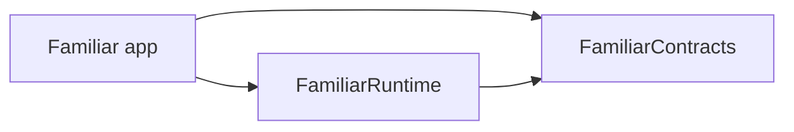
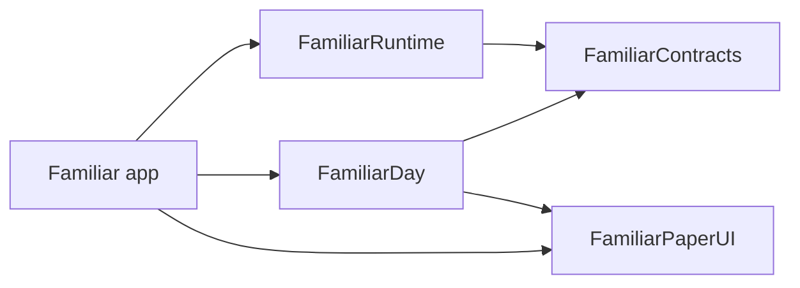
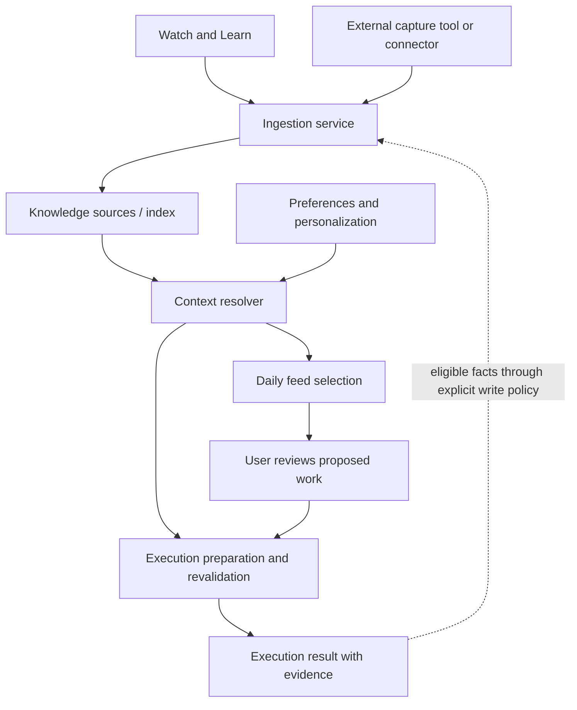

# Familiar: code structure for the next phase

**Status:** Stage 1 implemented on `codex/modular-cleanup`; remaining stages are planned. The module boundary from stage 4 was brought forward to enforce the first extraction immediately.

**Basis:** Main checkpoint `9fdba88`, pushed before cleanup on September 26, 2026. It preserves the Claude CLI connection, background execution/ghost cursor/peek, and origami work. Its 84 tests in 13 suites passed. This is a source-and-test assessment, not fresh verification of live desktop interactions.

### Goals and scope — clarified September 27, 2026

1. **Retain existing functionality.** Preserve Chat, API/Claude Code connections, Watch and Learn, pen/notes, foreground/background execution, confirmations, Stop, and companion/origami behavior, along with settings, stored data, and packaging. Separate any intentional behavior change from structural moves so it can be reviewed explicitly.
2. **Keep Waxwing integration possible.** Keep external-service details out of feature state and inject dependencies at app composition. No Waxwing implementation, API repair, integration testing, or backend choice is required to finish this cleanup. The earlier investigation in sections 8–9 is deferred reference material.
3. **Make feature development independent.** Existing and future feature sets own their state and workflows, use shared services through narrow interfaces, and cooperate without reaching into another feature's mutable implementation. Adding a feature should normally touch its own code and app composition, rather than require changes throughout Chat, Watch, and the shell.

Independent features still share the app's settings, native capabilities, and explicit resource-conflict rules. Independence does not mean separate apps, a package per feature, or unrestricted concurrent desktop control. Extract boundaries demonstrated by current callers; add new interfaces when a real consumer needs them. Daily cards, ingestion, personalization, scheduling, and connector implementations are separate feature work, not cleanup acceptance criteria.

### Implemented boundary

- `FamiliarContracts` owns the existing conversation interface, replies, errors, and tool results/executor.
- `FamiliarRuntime` owns the API and Claude Code providers, subprocess helper, Python runtime discovery, and per-request tool routing. Its target depends only on Contracts and Foundation; it cannot import the executable app.
- `Familiar/App` chooses providers and injects settings, credentials, resource locations, logging, and native tool handlers. Chat and the headless command use the same `ExecutionTools` composition and runtime router.
- `Familiar/Knowledge/PackContextProvider` assembles today's pack documents, anchored notes, and configuration notices for both callers. It remains app-local while its pack and scene models remain there; it is not yet the future cross-module knowledge interface.

The router snapshots registrations for each request. Only selected active/global scripts and enabled native capabilities are registered. Unexpected namespaces cannot fall through to an unrelated handler. This intentionally tightens dispatch: previously an unadvertised script or background tool could still reach some handlers. Script arguments, provider definitions, image results, and existing prompt formatting remain unchanged.

Conversation history still uses the existing provider-shaped dictionaries so opaque thinking signatures and image content survive replay. The extraction does **not** yet introduce typed jobs/approvals, complete cancellation of script subprocesses, separate Watch/shell owners, or the daily/Waxwing features. The full cleanup acceptance criteria below are not yet met.

**Stage 1 validation:** `./scripts/test.sh` passes 103 tests in 18 suites (19 added). The runtime target builds independently. The release app builds through `./scripts/build.sh release`, passes `codesign --verify --deep --strict`, and passes the packaged `--selftest` from an unrelated working directory using empty temporary packs and temporary app storage. Bundle helper discovery resolves correctly. No live provider call or desktop-control interaction was used for these checks. Existing concurrency warnings remain in native shell/target code and the moved subprocess helper.

## 1. Product workflow the structure must support

> Here is work identified for you today. Here is what I can take care of. Once you approve, I work in that window while you carry on.

The daily experience owns discovery, presentation, and proposed work. A shared execution capability owns doing approved work. Progress, questions, and results remain connected to the item that initiated it.

This is one architectural stress test, not the only feature the structure should support: a future day card should be able to request work, observe progress, answer a pending request, cancel, and display the result without importing the chat feature or manipulating its history. During cleanup, validate that boundary with fixture callers of today's execution behavior; no Day implementation is needed.

This proposal prepares those boundaries. Building the daily feature, connecting its data sources, and designing the pack-opening experience are subsequent work.

## 2. Decisions proposed for this cleanup

| Decision | Reason |
| --- | --- |
| Keep one repository and one installable app. | One place to configure Familiar and grant macOS permissions. |
| Begin with three SwiftPM targets: contracts, runtime, executable app. | Enforce the most valuable dependency boundary without creating a package for every feature. |
| Give chat, learning, contextual notes, and companion behavior separate owners. | New behavior should have a clear home and lifetime. |
| Use a shared execution service from chat and the headless entry point. | Remove duplicated routing before adding another caller. |
| Preserve the existing native control mechanics during extraction. | Coordinate transforms, event handling, target verification, and cleanup already have substantial implementation and tests. |
| Separate product data from its paper appearance. | Chat messages, screen annotations, and daily items have different meanings and persistence needs. |
| Keep current on-disk formats and bundle/resource layout through cleanup. | Structural changes should not require a user-data migration. |

The baseline was checkpointed and pushed before moving files. Cleanup stays on a feature branch for review and rollback.

## 3. Proposed structure after cleanup

The names below are proposed responsibilities, not a requirement to create every listed file immediately. Indented folders inside a target remain folders; the three top-level source directories are compiler-enforced modules.

```text
Package.swift
Sources/
  FamiliarContracts/                 # Foundation; values and interfaces shared across boundaries
    Conversation/                    # requests, replies, content, provider interface
    Tools/                           # definitions, invocations, results, JSON values
    Execution/                       # run/job identity, pending requests, progress, outcomes
    Context/                         # screen context and encoded image values
    Knowledge/                       # future integration interfaces; add with a concrete consumer

  FamiliarRuntime/                   # Foundation; orchestration and non-UI implementations
    Conversation/
      ConversationSession.swift      # owns conversation context and turn lifecycle
      Providers/
        ClaudeAPIClient.swift
        ClaudeCodeClient.swift
    Execution/
      ExecutionCoordinator.swift     # owns running work and pending decisions
      ToolRouter.swift               # shared dispatch and per-run capability checks
    ToolPacks/
      ToolCatalog.swift              # pack discovery/selection and snapshots
      PackModels.swift               # pack, script, document descriptors
      ContextNotesStore.swift        # existing anchored notes and their storage rules
    Knowledge/                       # future shared retrieval; current pack context stays focused
      ContextResolver.swift          # add when a concrete consumer needs retrieval beyond packs
    Processes/
      ScriptRunner.swift
      ProcessRunner.swift
      RuntimeEnvironment.swift       # configured executable/helper locations

  Familiar/                          # executable; composition, native implementation, features
    App/
      main.swift                     # selects GUI or headless command
      AppDelegate.swift              # macOS application lifecycle
      CompositionRoot.swift          # constructs dependencies and chooses implementations
      ShellCoordinator.swift         # windows, focus, feature presentation, activity conflicts
      Commands/                      # ask, summarize, render, existing self-test entry points
    Configuration/
      Settings.swift                 # settings values; preserves current serialized keys
      SettingsStore.swift            # loading, saving, existing migrations
      AppPaths.swift
      SecretStore.swift              # existing Keychain/file implementations
      Signing.swift
      Log.swift
    Features/
      Chat/                          # ChatModel, ChatView, feature prompts, transcript formatting
      WatchLearn/                    # workflow state, recording models, summarizer, pack writer
      ContextNotes/                  # pen flow, editor, anchor-based note interactions
      Companion/                     # mascot, origami controller/path/timing, hide/reveal behavior
      Settings/                      # settings presentation
    Native/
      Context/                       # AX inspection, context watcher, shared hit testing
      Capture/                       # native screenshot acquisition and coordinate mapping
      Control/                       # current ComputerController and Background mechanics
      Tools/                         # native screen-reading and computer tool adapters
      Permissions/                   # macOS permissions and global hotkey adapters
    Presentation/
      Shell/                         # BubblePanel and shared window chrome
      Paper/                         # paper surfaces, tabs, layout and visual primitives
      Execution/                     # peek/progress/receipt presentation adapters

Resources/py/                        # existing helper location retained
tools/                               # existing bundled tool packs retained
Tests/
  FamiliarContractsTests/
  FamiliarRuntimeTests/
  FamiliarTests/                     # native policy, feature lifecycle and presentation logic
scripts/                             # existing build, test and release entry points
docs/architecture/
  next-phase-structure.md
```

`ToolPacks` owns today's pack selection, scripts, and stored screen annotations. Its concrete domain models belong there, not in `FamiliarContracts`. Keep the current pack context separate from executable tools. A future `Knowledge` boundary can support scoped retrieval and captured or external knowledge without treating every document as an executable capability. Define that broader contract when its first integration is built; neither empty interfaces nor vendor implementations are needed during cleanup. See the deferred stress test in section 8.

Native extensions for coordinate conversion and accessibility remain in the app. Watch recordings and learned-pack drafts belong to `WatchLearn` even where their types happen to use only Foundation. Only source/evidence values that cross the ingestion or retrieval boundary become knowledge contracts.

Settings, secrets, logging, and resource paths are supplied to runtime components as the values or narrow dependencies they need. The runtime does not load the entire app configuration or choose the app's secret store itself. Pack-specific credentials are resolved at invocation time through an injected lookup and are not included in pack snapshots or receipts.

### Dependency direction

Arrows mean “imports.”



The runtime calls native functionality through interfaces in `FamiliarContracts`; the composition root supplies the implementations. It never imports the executable app, SwiftUI, AppKit, or Accessibility types. Native implementations may use the main actor where macOS requires it.

Inside the executable, feature-to-feature cooperation goes through explicit operations or shell coordination. Features do not access another feature's mutable state. These internal rules are initially architectural conventions; additional targets can enforce them when useful.

Use direct asynchronous calls for requests and typed observable state/events for progress. A subscriber should receive the current state when it attaches, so reopening a view does not miss earlier progress. Do not introduce a general event bus or plugin framework for this work.

Give mutable history, cancellation and pending decisions one explicit owner; publish immutable snapshots to main-actor view models. Use transferable value types across concurrency boundaries. Preserve existing actor isolation during extraction rather than changing scheduling merely because a file moves.

`ConversationSession` is the single storage owner of a conversation's history. Provider adapters translate it to and from wire formats, retaining opaque provider-specific fields in session-owned state. They do not maintain a second competing history. Serialize turns within a conversation; concurrent independent conversations use separate provider instances and run state, with fixed options for each turn. A shared mutable effort/tool-limit/cancellation callback must not couple unrelated jobs. Native operations hop to the main actor as required by their implementation.

### Where the future daily feature fits

When its first implementation begins, introduce `FamiliarDay` and extract the reused visual primitives into `FamiliarPaperUI`:



The app injects the execution service and context/knowledge interfaces. `FamiliarDay` owns daily items, pack generation/refresh, feed selection and deduplication, review state, and day history. Shared ingestion, source connectors, and reusable personalization do not belong to Day. It has no dependency on `Assistant`, the native mouse controller, or either Claude implementation. `FamiliarPaperUI` owns visuals and interactions, not jobs, source connectors, or persistence. Neither future target needs an empty scaffold during cleanup.

## 4. Work continues independently of the window

For this cleanup, extract ownership of existing execution, history, confirmations, Stop and resource cleanup while retaining their current behavior. The job/card concepts below describe the direction that extraction should permit. Whole-card approval, proposal revisions, durable job records and new completion-evidence policies are future feature design, not additional behaviors to build during restructuring.

There are three different lifetimes:

| Concept | Owns | Ends when |
| --- | --- | --- |
| User-visible job | Intent, origin, approved scope, pending requests, outcome | The work finishes, fails, or is cancelled |
| Conversation/model turn | One exchange with an AI backend, including its tool loop | That provider turn returns or is cancelled |
| Native control session | Window binding, event monitors, mouse grant, overlays, capture resources | Native resources are released |

A job may contain multiple model turns and multiple control sessions. They must not share one implicit lifetime.

This matters to existing behavior: an irreversible-action confirmation currently returns through chat and continues in a later turn; borrowing the mouse waits inside an active turn. The migration must preserve both behaviors rather than forcing every approval to keep an AI request and a window session alive.

The execution coordinator owns active work at app scope. Views subscribe to it; view visibility is not the owner. Proposed initial behavior is that approved work continues when the pack closes or the user switches views, while starting new work and stopping work remain explicit actions.

Recommended first scheduling policy: one active desktop-control job. Ordinary viewing, knowledge processing, and independent read-only AI requests need not share a global `busy` flag. Defer multiple concurrent desktop jobs and a persistent execution queue until the product needs them. A shared activity/resource owner enforces capture/control conflicts below feature UIs; the shell presents those decisions and coordinates windows, focus and companion animation. Merely disabling a button in one feature is insufficient enforcement for other callers.

The control lease is enforced below the feature UIs. Initially, a second control request reports that another job is active rather than silently entering a queue. Waiting for a decision may release input resources while retaining the active job identity. Keep results in app-owned memory independently of view visibility; persistence across app restarts is future work.

“Carry on” initially means working elsewhere subject to the current conflict rules. The existing controller stops on interaction with its target window and has restrictions around simultaneous input in the same app. This restructure does not promise simultaneous human and agent editing of the same window.

### Minimum shared execution contract

Names describe responsibilities for the future workflow. Implement only the subset needed to represent today's callers, confirmations and lifecycle during cleanup; extend it with real feature requirements later.

| Value or operation | Required meaning |
| --- | --- |
| Work request | Stable identity, initiating feature/item reference, intended outcome, relevant context and requested capabilities |
| Target/context reference | Explicit binding information; the future daily feature must not silently treat whichever window is frontmost as its intended target |
| Pending request | Request ID, owning job, request kind, proposed scope, and the revision/context against which it was presented |
| Decision | Accept, decline, or cancel a particular pending request; stale or mismatched replies cannot authorize new work |
| Progress | Structured current state and step information, separate from human-readable captions |
| Result | What happened, verification evidence when available, remaining work, failure/cancellation information, and originating item reference |
| Cancel | A request to stop work followed by cleanup and one terminal result |

Keep initial job approval, approval for a particular consequential action, and permission to borrow foreground input distinct. The current label-based native guard remains a lower-level implementation safeguard; it does not define the meaning of approving a whole daily card. The user still needs to decide that scope.

Repeated delivery of the same decision is idempotent. Editing the proposed work invalidates its old approval; ordinary progress updates do not. A control-specific approval cannot accidentally transfer to another window. Model-generated captions and suggestion strings do not themselves create authorization.

All tools for a run—native actions, scripts, and integrations—go through the same router and the run's explicit capability context. Present-day authorization is mapped into this boundary during migration. Do not silently broaden it or introduce a new approval dialog for every existing chat request as part of cleanup.

The AI turn ending is not proof that the user's intended task succeeded. Preserve useful existing receipts while separating “the run ended” from “the outcome was verified.” A future card needs to distinguish finished, partially completed, awaiting the user, and uncertain outcomes.

Cancellation must reach provider requests, tool work, child processes and native cleanup. Report terminal cancellation only after owned work can no longer produce later effects; stopping the progress indicator alone is insufficient. A low-level verifier observing a screen change is evidence about that action, not proof of the user's entire goal.

Preview frames are transient presentation data. Keep their high-frequency native image pipeline separate from persisted job history, and avoid turning every screenshot into a durable event. Daily items may retain a compact receipt without retaining all frames or provider transcripts.

## 5. What moves out of the current files

| Current source | Proposed responsibility split |
| --- | --- |
| [Assistant.swift](../../Sources/Familiar/Assistant.swift) | Chat state stays with Chat; Watch workflow moves to WatchLearn; routing/session ownership moves to Runtime; expansion/size/focus moves to the shell. |
| [AppDelegate.swift](../../Sources/Familiar/AppDelegate.swift) | Lifecycle stays; construction moves to CompositionRoot; focus, windows, hotkey priority, and feature conflict decisions move to ShellCoordinator. |
| [Conversation.swift](../../Sources/FamiliarContracts/Conversation.swift), [ClaudeClient.swift](../../Sources/FamiliarRuntime/Conversation/ClaudeClient.swift) | Extracted: shared interfaces/results are in Contracts; API/CLI implementations are in Runtime; backend selection is in app composition. |
| [main.swift](../../Sources/Familiar/main.swift) | Retain dispatch; move commands into files; GUI and `--ask` use the same tool router and execution lifecycle. |
| [PeekNote.swift](../../Sources/Familiar/Background/PeekNote.swift) | Shared execution state is separated from observable view adapters and SwiftUI rendering. |
| [ComputerControl.swift](../../Sources/Familiar/ComputerControl.swift), [Background/](../../Sources/Familiar/Background/) | Keep native mechanics together; replace dependencies on chat/paper state with execution events and native presentation adapters. |
| [ToolRegistry.swift](../../Sources/Familiar/ToolRegistry.swift), [ScriptRunner.swift](../../Sources/Familiar/ScriptRunner.swift) | Runtime ToolPacks models/catalog and script execution; runtime discovery is independent of pack discovery; callers consume stable snapshots. |
| [Notes.swift](../../Sources/Familiar/Notes.swift) | Anchored-note data/matching/storage belong to Runtime ToolPacks; native geometry and hit testing remain in the app. |
| [WatchRecorder.swift](../../Sources/Familiar/WatchRecorder.swift) | Keep recording ownership in WatchLearn; replace its dependency on an inert WandController with shared native hit testing. |
| [NotePad.swift](../../Sources/Familiar/NotePad.swift), [BubblePanel.swift](../../Sources/Familiar/BubblePanel.swift) | Separate chat grouping/reveal behavior, reusable paper components, and shell/window state. |
| [Prompt.swift](../../Sources/Familiar/Prompt.swift) | Feature-specific prompt assembly stays with the feature; generic execution instructions belong to Runtime; native tool guidance belongs with native adapters. |

Important extraction details:

- `ToolResult`, `ToolExecutor`, and `ClaudeReply` now live in Contracts. A later typed JSON representation can replace arbitrary script arguments without forcing every script to have a handwritten Swift type; this first extraction preserves their existing wire representation.
- Preserve provider-specific thinking/signature blocks, tool round trips, and image behavior when adapters encode/decode session-owned history. Typed feature-facing values should not cause a lossy rewrite of that history.
- `Config` and `Secrets` currently refer to each other. Separate settings values, app paths, storage, and secret lookup before moving runtime consumers.
- `BuiltinTools` combines file tools with Accessibility reading. Separate those implementations before moving the Foundation-only portion.
- `IrreversibleGuard` uses normalization from `NoteAnchor`; extract that small common operation so control does not depend on contextual-note models.
- Python helpers and `uv` are copied manually into the app. Inject their locations and preserve packaging, bundle identity, signing, and permission behavior. Moving a file into a Swift target does not move its resources automatically.

## 6. Migration sequence and review gates

Each stage changes the maintained app and leaves it usable. File moves and behavioral changes should be separately reviewable where practical.

| Stage | Changes | Reviewable result and gate |
| --- | --- | --- |
| 0. Preserve the baseline | Checkpoint existing work and document current interaction behavior. | Current build/test baseline recorded; preserve uncommitted features and existing data. |
| 1. Extract contracts and common routing | Move shared values/interfaces; split resource discovery and dependencies; route Chat and CLI through one dispatcher; distinguish executable tools from knowledge/context sources. | Both entry points exercise the same routing tests; existing pack context is supplied through a focused interface without adding a new backend. |
| 2. Own execution explicitly | Extract current conversation/run ownership, confirmations, cancellation and result reporting into shared services; adapt today's UI without changing its approval semantics. | Fixture callers exercise existing behavior without constructing Chat; tests cover turn/session boundaries, stale decisions, stopping while waiting, one terminal result, and native cleanup. |
| 3. Separate existing feature state | Extract Watch lifecycle and notes service; separate shell state and reused paper primitives from Chat. | Chat clear, Watch keep/discard, window close, settings changes, and feature conflicts have explicit owners and regression coverage. Watch-owned recording objects do not become a runtime dependency. |
| 4. Enforce modules and verify packaging | Move cleaned code into the three targets; update imports, access levels and test targets. | Runtime builds without UI/native imports; deterministic suite passes; packaged helpers resolve; existing signing/resource layout is preserved. |

Implementation order: stages 0 and 1 are delivered on the cleanup branch, along with the three-target enforcement part of stage 4. Next extract the execution owner and lifecycle in stage 2, then feature/shell ownership in stage 3. Moving the remaining pack/script models and final native interaction verification remain part of stage 4. Each stage should be a separate reviewable change; module creation is not evidence that the whole ownership migration is complete.

Before and after moving a boundary, add only the tests needed to establish its behavior. Current coverage is strongest around the CLI bridge and native policy/geometry. Prioritize missing orchestration tests rather than duplicating those algorithms' tests. Include an HTTP-provider fixture test, shared tool routing, cancellation, resource paths, and Watch persistence where the extraction touches them. Tests should use temporary storage and fake backends instead of the user's credentials or live screen.

During implementation, package and live interaction checks are separate from unit tests. The final behavior check should cover chat, Watch, pen/notes, foreground/background control, confirmation, Stop, and origami. Preserve the existing interaction rules during structural migration; surface any intentional product changes separately.

### Cleanup is complete when

- Existing workflows and stored data remain compatible, with regression checks for the behavior touched by each extraction.
- The same runtime serves existing Chat and CLI entry points.
- A test caller can start work, observe it, answer a pending request and cancel without constructing Chat or a window.
- Feature state and shell state have separate owners; features cooperate through explicit operations rather than another feature's mutable state.
- The runtime cannot import the app, SwiftUI, or native desktop APIs.
- A future feature can use shared execution/context capabilities through app composition without depending on Chat or Watch internals.
- External integration details remain replaceable at the app/service boundary; no Waxwing code or running Waxwing service is required for completion.
- Resource lookup, settings, signing and on-disk formats remain compatible.

At that point, the structure is ready for the next chosen feature set, including the proposed daily experience. Do not extend cleanup into speculative source connectors, a general workflow language, autonomous scheduling, process isolation, or a rewrite of the control algorithms.

## 7. Product and design decisions to review

The following belong to future product/design work, not prerequisites for this cleanup. Preserve existing user-facing behavior while extracting its owners. Structural extraction can proceed without resolving the daily experience or Waxwing design.

| Decision | Proposed starting point | When your input is needed |
| --- | --- | --- |
| First pack's contents and sources | Define one representative useful day and the smallest source set that produces it. | Before implementing day generation or connectors. |
| Pack entry point and coexistence with chat | Same app/companion; exact surface remains open. | Before designing navigation and the pack view. |
| Approval scope | Show a concrete offer and approve that scope; choose whether v1 supports a single action or a reviewed sequence. Batch approval remains open. | Before implementing card-to-job authorization. |
| Closing the pack | Approved work continues; reopening shows current state. | Confirm this workflow default before daily integration. |
| Attention and progress | Progress/result on the originating card; live preview on demand; requests appear without unexpected focus changes. | Design the working, waiting and result states. |
| Meaning of completion | Show what was achieved and distinguish partial or uncertain outcomes. | Define completion evidence for each initial actionable card. |
| Quitting/relaunching | Stop active execution on quit; no automatic resumption. Define how interrupted work is represented when durable jobs arrive. | Before job persistence and recovery. |
| Tomorrow and refresh | Preserve meaningful edits and results; decide how unfinished items carry forward. | Before choosing daily storage and refresh rules. |
| Generation timing | On-demand versus scheduled behavior remains open. | Before adding any scheduler or background refresh policy. |
| Knowledge capture scope | Explicit Watch sessions processed automatically versus continuous capture remains open. | Before implementing capture-to-knowledge ingestion. |
| Knowledge ownership | Waxwing is the preferred shared knowledge integration; local files remain an alternative and a home for private/staged data. | Decide publishing/retention scope before implementing ingestion; see section 9. |

Daily history and durable execution records require their own versioned, atomic storage with visible failures. They do not belong in `config.json`. The cleanup introduces clear owners and identities; it does not commit to a database or claim that background work survives app termination.

For design review, a rough storyboard is sufficient: **open pack → scan items → inspect an offer → approve → carry on in another window → answer an interruption if needed → see the result → revisit unfinished work tomorrow.** Include an empty day and a failure/partial-result state. Final art, animation timing and sound can follow the interaction decisions.

Engineering can own target names, dependency injection, protocol placement, test organization, and the mechanical extraction sequence. Your review should focus on whether these ownership and workflow defaults support the product you intend to build.

## 8. Deferred reference: captured knowledge, personalized execution and a daily feed

This earlier stress test records possible future requirements. Its ingestion, retrieval and personalization contracts are not deliverables or acceptance gates for the current restructure.

**Verdict:** The three-target dependency structure survives. The earlier responsibility split needed refinement: tool packs are only one knowledge source, and a screen recording feature must not become the shared memory owner. These scenarios are evaluated as future requirements; this document does not authorize implementing those integrations now.

### Two flows, one shared source of context



The diagram is data flow, not module imports. An external tool may already perform capture, storage and indexing. The ingestion service can adapt its API and track accepted source IDs; Familiar does not necessarily implement every box locally.

| Responsibility | Owner and boundary |
| --- | --- |
| Record/review an observed workflow | WatchLearn plus native capture; exports an explicit source package rather than exposing its entire `Recording` object. |
| Accept, deduplicate, synchronize and index sources | Shared knowledge ingestion; independent of the Watch window and of desktop-control ownership. |
| Canonical records and search indexes | A configured local or external knowledge source; adapters expose stable source IDs, revisions and retrieval status. Avoid two conflicting sources of truth. |
| Select useful evidence for a purpose | ContextResolver combines a scoped query, available knowledge, task/screen context, freshness requirements and relevant preferences. |
| Own reusable personalization | A small shared preference/profile service, separate from chat history and feed presentation; explicit preferences and inferred signals remain distinguishable. |
| Decide what belongs in today's feed | FamiliarDay uses retrieved evidence, its time horizon, novelty, previously shown items and user edits. |
| Execute a selected action | Existing execution service consumes relevant context, revalidates where needed and enforces the approved scope. |

ExecutionCoordinator remains responsible for work ownership, decisions and cleanup. When shared retrieval is implemented, it should delegate to a context resolver and leave indexing, connector sync, recommendation ranking and profile inference outside execution. The knowledge implementation can become a separate Swift target when concrete implementations warrant it; the proposed dependency direction permits that move without defining speculative interfaces now.

### Feature 1: Watch Me connected to automated knowledge capture

Watch submits an explicit export with an ID, scope, capture time, source references and the content permitted by the chosen capture policy. The ingestion acknowledgment means the source has been accepted durably, not necessarily that it is searchable. Indexing may complete later; status distinguishes captured, accepted, processing, available and failed.

This introduces a separate ingestion lifecycle. An upload retry should reconcile to the same source instead of creating duplicate facts. Raw artifact ownership must transfer or be copied before the recorder deletes its temporary files. Today, Keep/Discard and conversation cleanup remove recordings; that behavior cannot be carried blindly into an asynchronous uploader.

Define what Discard, correction, and deletion mean for already submitted data and any derived index/cache. An external knowledge base may have capabilities or delays that the adapter must expose rather than conceal. A UI close is not the same as a source deletion.

“Automatic” needs one product clarification: automatic processing after an explicit Watch session is different from continuous passive capture. The latter adds activation, resource-conflict and retention decisions. This proposal accommodates either without assuming continuous recording is authorized.

### Feature 2: personalized context for work and for the feed

Both consumers use a shared query/evidence contract; they do not need identical context results.

| Consumer | Typical retrieval needs |
| --- | --- |
| Preparing/executing a task | The relevant procedure, exact entities, current target state, actionable constraints and sufficiently fresh evidence. |
| Generating the daily feed | Recent changes, deadlines, relevance to this person, novelty, diversity and what was already shown or dismissed. |

Queries identify the purpose, relevant person/workspace scope, task or time range, and freshness/budget requirements. Results include supporting excerpts or facts, source references/revisions, when they were observed or fetched, and known staleness or retrieval gaps. Scope filters belong before evidence is delivered to a consumer. Consumers can explain why an item appeared and return to its source.

The index helps find context; live tools or authoritative sources may be needed to establish the current state before a consequential action. For example, a morning card might say an expense report is unfinished, but the person could submit it before clicking the card. Execution must check again rather than treating the morning summary as current truth. Personalization may rank that report highly; it does not grant permission to submit it.

Reuse source retrieval and evidence assembly. Keep feed ranking and presentation in Day, and execution-specific context preparation with the work flow. Cache keys include relevant purpose, scope, source revision/freshness and profile revision; a cached morning summary is not a universal execution context.

Captured observations, inferred procedures/preferences, executable tools, approved work and verified results retain separate meanings. An AI-generated summary does not silently become a confirmed fact or a new executable capability. Any feedback write from execution carries its source/evidence and passes through ingestion policy; failure or a model's unverified success claim cannot automatically train the next run as a successful procedure.

### Concrete break cases and proof checks

| Stress case | Failure in a tightly coupled design | Required behavior / proof check |
| --- | --- | --- |
| A Watch upload fails, the view closes, and the app retries later | Recording is deleted or uploaded twice. | The ingestion receipt owns the accepted source; durable retry/deduplication belongs to ingestion, with recoverable failure state. |
| One captured procedure is useful to both Chat execution and Day | Each feature builds its own index and prompt rules. | Both use the same source/evidence contract; neither imports WatchLearn. |
| The same person asks for a task and a daily digest | One shared prompt returns irrelevant context to one caller. | Purpose-specific queries share retrieval machinery while producing appropriately scoped evidence. |
| A source changes after a feed card was generated | Familiar repeats completed work or acts on an outdated entity. | The card retains source references; execution refreshes necessary facts and rechecks its proposed work. |
| A source is deleted, becomes inaccessible, or belongs to another workspace | Old caches still return it. | Retrieval and derived caches honor scope and source lifecycle; tests cover revocation/deletion propagation under the chosen backend contract. |
| A feed is refreshed while background execution runs | A global busy flag blocks useful read-only work, or capture races control. | Knowledge work has its own lifecycle; resource conflicts are enforced by the shared activity owner. |
| Knowledge service is unavailable | Every app feature fails or stale facts look current. | Retrieval reports unavailable/partial/stale status; unrelated actions still work and dependent work can request missing context. |
| An execution writes an uncertain result back to knowledge | The model repeatedly reinforces its own incorrect conclusion. | Write provenance and evidence explicitly; distinguish observations/inferences from verified outcomes. |

These checks become implementation tests when their corresponding feature exists. Cleanup needs to preserve current pack behavior through the focused context helper and prove shared services usable by independent fixture callers. Broader knowledge interfaces, a vector database, a knowledge graph, a new backend, and a durable desktop-execution queue are outside its scope. An ingestion retry queue is a separate concern if ingestion is later implemented.

## 9. Deferred reference: Waxwing App and local files

Waxwing is a possible later integration, not an active cleanup workstream. The findings below preserve the September 26 investigation for later revalidation; none requires an implementation or fix during this restructure.

The user identified `/Users/david/projects/waxwing-app` as the preferred integration, while keeping Familiar-managed/local-file knowledge possible. The following findings come from that sibling checkout's current source and contracts. Its old `spec/` directory is explicitly historical. `GET http://127.0.0.1:4310/api` could not connect during this review; no service was started, authenticated content accessed, or Waxwing data modified.

### What Waxwing already supplies

| Existing capability | Fit for Familiar | Limit or integration work |
| --- | --- | --- |
| Versioned Markdown pages with stable item identity and optimistic update checks | Store a curated learned procedure and retrieve the precise version that informed a task. | Map Watch's accepted draft to a page; retain remote IDs/revisions and handle update conflicts. Page creation does not expose a caller-supplied idempotency key in its current schema. |
| Evidence-backed work reports, explicit observations/interpretations/hypotheses, checks and revisions | Publish suitable execution evidence or a learned account where the report's domain fits. | Reports require a repository-oriented scope and text evidence. They are not a generic raw Watch-session or image-attachment format. Do not invent repository provenance to satisfy the schema. |
| Retry-safe work-report submissions by UUID; conflicting reuse rejected | Reliable publication for reports using that specific API. | Page publication needs its own retry/reconciliation approach; idempotency is not a blanket property of all endpoints. |
| Workspace search with item/version/digest/locator references, keyword retrieval and optional local reranking | Find source material for both task context and feed candidates. | Search has no user-interest, task-purpose or time-range inputs. Results are snippets; fetch underlying sources for sufficient context and timestamps. Preserve reported fallback ranking status. |
| Citations, version-change status, and an attention list | A useful feed input: “this procedure may need revisiting because its source changed.” | Attention is documentation drift, not a general activity stream or personalized daily digest. |
| Workspace membership and agent read/write credentials | Authenticated retrieval and separately configured ingestion. | Current API is loopback-only. Agent credentials cannot delete content; access is workspace-wide, not a per-document personalization permission model. |

Source references: [page contracts](../../../waxwing-app/packages/contracts/src/pages.ts), [work-report contracts](../../../waxwing-app/packages/contracts/src/work-reports.ts), [report persistence/retry behavior](../../../waxwing-app/apps/api/src/work-reports.ts), [search contracts](../../../waxwing-app/packages/contracts/src/index.ts), [search implementation](../../../waxwing-app/apps/api/src/search/search.ts), [HTTP routes](../../../waxwing-app/apps/api/src/app.ts), and [authentication enforcement](../../../waxwing-app/apps/api/src/auth-http.ts). Some older prose still describes an unauthenticated single-user slice; the current authentication implementation takes precedence.

Work-report supersession deserves specific handling: a revised report has a new submission/item linked to the previous one. `history=false` search alone does not establish that a report is the latest applicable account. The adapter should inspect the report's supersession metadata for current-procedure use, while retaining exact historical citations when requested.

### Recommended ownership with Waxwing

**Familiar owns:** desktop capture, review of what was learned, individual preferences, personal feed state, task proposals, approval and execution, and local staging for pending ingestion. **Waxwing owns:** the published shared knowledge and its source versions, evidence accounts, search and citation relationships.

Add `WaxwingKnowledgeSource` and `WaxwingKnowledgeWriter` behind the shared knowledge interfaces when integration begins. A source and a writer are separate capabilities: a configured read connection must remain useful without publishing anything. Use the documented API and validate responses against its contracts; never couple Familiar to Waxwing's PostgreSQL tables or import the sibling app's implementation.

A file-backed source can implement the same retrieval/evidence projection using stable IDs, metadata, content revisions and explicit source roots. A file writer can provide a standalone local mode. It does not need to reproduce Waxwing's collaboration and citation UI. Declare unsupported operations rather than pretending all backends offer identical deletion, attachments or revisions.

Choose one authoritative destination for each knowledge scope. A local upload outbox/cache is not a second editable copy of shared Waxwing knowledge. Supporting both backends does not imply automatic bidirectional synchronization. An unavailable Waxwing connection leaves publication pending/failed; it does not silently switch canonical storage to local files. References include backend/workspace identity so a local record and a Waxwing record cannot accidentally collide. Individual inferred preferences and personal feed history stay local by default unless a separate sharing behavior is designed.

### Integration gaps that affect the plan

1. **Watch handoff:** Prefer a reviewed Markdown procedure for the first general workflow integration. Use a work report when its evidence and scope actually fit. The current `PackDraft` lacks explicit claim-to-event provenance; an evidence-backed report requires preserving those references during summarization. Introduce stable capture/submission identity and persist the exact outgoing payload for retry. Keeping screenshots remotely needs an explicit artifact/attachment design; current report evidence is text. Raw recording retention and what is automatically published remain product decisions.
2. **Personalization and feed assembly:** Familiar's context resolver adds task/person relevance over Waxwing retrieval. Day adds novelty, daily selection and previously shown/dismissed state. A complete “what changed since yesterday” feed may require a Waxwing change-list/cursor API; the current attention endpoint and keyword search do not provide a complete change stream.
3. **Deletion and recovery:** A local discard cannot promise to retract a published report through an ordinary write token. Separate cancelling unpublished ingestion, local cleanup, and remote retention/deletion. Respect capabilities exposed by the selected backend.
4. **Freshness:** Preserve source IDs/revisions and load authoritative current content when preparing work. Search references may distinguish an annotation's source from the target it annotates; retain both. Source resolution must dispatch by content kind because Waxwing does not expose one generic reader for all result types. Refreshing context is separate from approving a materially changed proposal.
5. **Current connector drift:** Familiar's [search script](../../tools/waxwing/scripts/search.py) reads `results`, while Waxwing returns `hits`. The [attention script](../../tools/waxwing/scripts/attention.py) reads `pages`/`citations`, while Waxwing returns `items`/`changed`. These are source-confirmed field mismatches; no live integration was tested or application code fixed during this planning task. Add adapter fixtures from Waxwing's current contracts before relying on these calls for context or cards.

If integration is pursued, this check suggests one validated knowledge adapter shared by its consumers. It does not require a different app shell or a rewrite of execution. Cleanup leaves room to inject such an adapter later; it does not need to define it now. Waxwing writes, local-backend implementation, connector fixes and any Waxwing API extensions are subsequent feature work.
