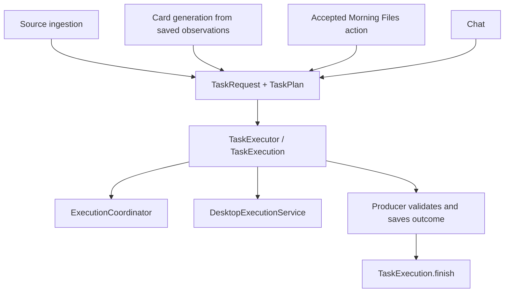

# Shared task execution

## Producers and execution

Source ingestion, card generation, accepted Morning Files actions, and chat produce work for the
same app execution entry point. Their domain rules remain separate:

- `CalendarCollectionRunner` captures source requests, dispatches a batch in
  order, validates submitted observations, and saves run history.
  `SourceCollectionTask` supplies each source's prompt and constrained tool policy.
- `CardGenerationService` reviews saved observations through a structured proposal
  tool, then reconciles proposals and commits generation receipts. It has no desktop
  tools and does not execute the suggested actions.
- `MorningTaskRunner` dispatches accepted `MorningWorkItem` records and saves their
  outcomes. Preparation actions have no desktop tools; desktop actions use the
  existing target selection and approval controls.
- `Assistant` supplies chat content and interprets replies. It passes its existing
  conversation coordinator so follow-up messages retain conversation history.

`TaskRequest` identifies one execution and its presentation: ID, title, initial
status, and task-panel or conversation placement. `TaskPlan` supplies input content,
image preparation, and a lazy preparation closure returning `PreparedExecution`.
That closure selects the system instructions and tool capabilities appropriate to
the producer; the executor does not infer a source policy or an action's authority.

## Ownership and completion

`TaskExecutor.begin` reserves an execution and returns a `TaskExecution` handle.
The handle runs its plan once through `ExecutionCoordinator`, connects cancellation
and native cleanup to `DesktopExecutionService`, and owns task-panel progress and
completion. Native background work can promote a conversation onto the task panel
without creating another execution. Headless chat, which has no desktop service or
task panel, continues to use the coordinator directly.

The producer interprets the returned `ExecutionResult` before calling
`TaskExecution.finish`. Source ingestion requires a fresh structured submission
with valid identity, scope, evidence and coverage, then commits the collected
result. A model reply alone cannot make ingestion successful. Morning Files saves
the work item's final status and result before presenting completion; if saving
fails, the task shows an unsaved failure and dispatch pauses. Chat interprets the
reply for its conversation or promoted task surface.

Native cleanup occurs as the coordinator completes; explicit `finish` records the
producer's final outcome and releases task presentation ownership. The executor
does not own source validation, card decisions, batch scheduling, or persistence.
Those decisions cannot be replaced by a generic successful provider response.

## Storage and views

`CalendarStore` owns source-definition validation and transactions. It depends on
`SourceRulesRepository`; the current `FileSourceRulesRepository` preserves
`~/.noteling/calendar/workspace.json` version 4. `SourceRulesSnapshot` contains
reusable definitions only. Older embedded observations arrive separately for
migration into run history before the rules file is replaced.

`SourceRunStore` owns run lifecycle and observable records. It depends on
`SourceRunRepository`; `FileSourceRunRepository` owns timestamped folders under
`~/.noteling/runs`, authoritative `run.json`, generated per-source JSON and
`report.md`, and atomic file replacement. The contracts permit repositories with
no folder location. Current files, permissions and migration behavior are retained;
this separation does not move synchronous file work off the main actor.

The task panel displays execution progress and outcomes. Morning folders and cards
present saved work; source-result and history views present saved run records.
These surfaces are not separate execution engines. Morning card/work persistence
remains in `MorningStore`; source repositories do not store accepted card jobs.

## Card generation and future personalization

`CardGenerationService` is now a separate producer that turns saved observations
and supplied context into persistent suggested cards. Generation does not accept
or execute a card's action. See [persistent cards](persistent-cards.md) for identity,
reconciliation, storage and human decisions. A future personalization stage can use
the same producer boundary; inferred preferences and relationships are not yet
implemented.
